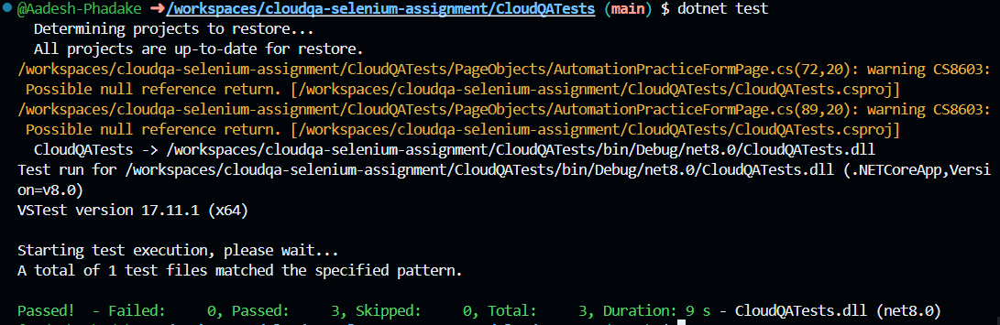
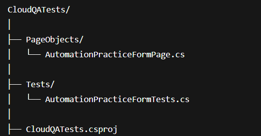

# CloudQA Automation Assignment – Selenium C#

This repository contains my solution for the CloudQA Developer Internship Assignment.
The task was to automate any three fields on the following page using C# + Selenium, ensuring robust and stable tests:

👉 https://app.cloudqa.io/home/AutomationPracticeForm

The solution follows the Page Object Model (POM) for clean, maintainable automation.

# Technologies Used

C# (.NET 8)

Selenium WebDriver

ChromeDriver

NUnit

GitHub Codespaces (Linux)

Page Object Model (POM)

# Automated Fields

I automated the following three stable form fields:

First Name

Last Name

Country / State dropdown

All tests validate data entry and proper UI behavior.

# How to Run Tests
1. Clone the repo
git clone https://github.com/your-username/cloudqa-selenium-assignment.git

2. Navigate into the test project
cd cloudqa-selenium-assignment/CloudQATests

3. Run the tests
dotnet test

✔ Expected output:
Passed! - Failed: 0, Passed: 3, Skipped: 0

# Test Run Screenshot

# Project Structure

# Page Object Model (POM) Approach

Clean separation of UI actions and test logic

Robust XPath selectors tied to label text

Dropdown selection via SelectElement

Explicit waits using WebDriverWait

This ensures long-term stability, even if the page layout changes.

# Test Cases Overview
✔ Test 1 — First Name

Enter text

Read back value

Validate match

✔ Test 2 — Last Name

Enter value

Verify correctness

✔ Test 3 — Country Dropdown

Select “India”

Assert selected option

# Author
Aadesh Ashok Phadake

CloudQA Internship Candidate

# Conclusion

This automation suite demonstrates:

Reliable Selenium C# automation

Page Object Model design

Robust selectors

Full compatibility with Linux (GitHub Codespaces)

Clean and maintainable code for cloudqa-selenium-assignment
